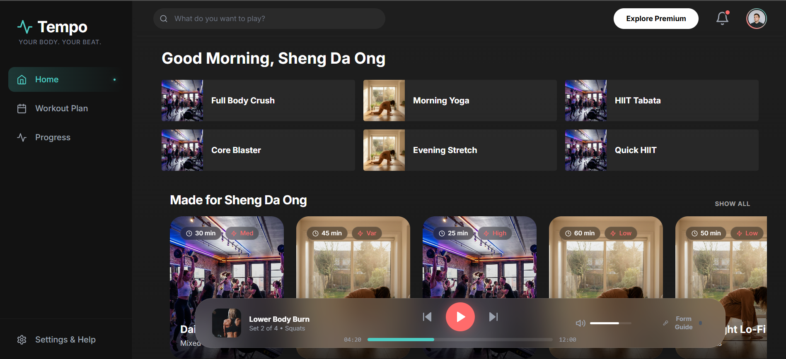
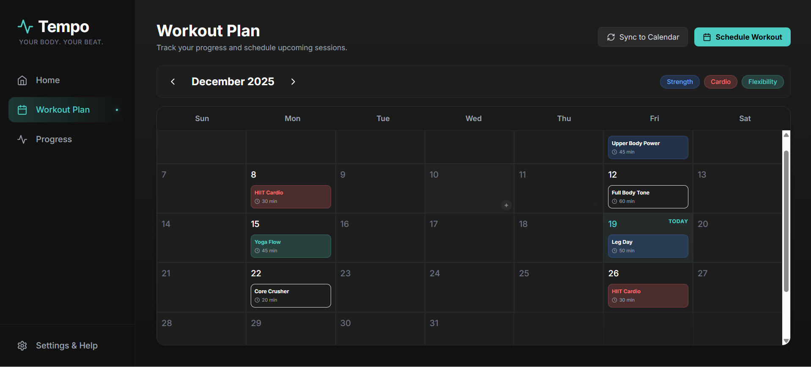

# Tempo - Fitness Web App

<div align="center">
  
</div>

<div align="center">
  <h3>Your Body. Your Beat.</h3>
  <p>Tempo is a premium fitness application that fuses high-energy workouts with a rhythmic, immersive interface.</p>
</div>

---

## ⚡ Overview

**Tempo** is a conceptual React web application designed with a **"Dark Mode Glassmorphism"** aesthetic. It moves away from sterile, white-walled fitness apps, instead offering a nightclub-inspired environment where fitness feels like an event, not a chore.

The interface prioritizes depth, motion, and clarity, using deep charcoal backgrounds, electric teal accents, and subtle blur effects to create a focused workout space.

## 🚀 Key Features

### 🎛️ Dynamic Dashboard
- **Personalized Content**: "Made for You" mixes and "Recently Played" sections that horizontally scroll (Spotify-style).
- **Time-Aware Greeting**: Dynamic welcome message based on the time of day.
- **Smart Assets**: Optimized local asset loading for instant visual feedback.

### 📅 Workout Calendar (New!)
<div align="center">
  
</div>

- **Monthly Overview**: Visual calendar to track scheduled sessions.
- **Auto-Scroll Focus**: Automatically scrolls to the current day so you never miss a beat.
- **Smart Layout**: Optimized 6-row grid that adapts to screen height without cutting off dates.
- **Sync Ready**: Placeholder functionality for external calendar synchronization.

### 🎧 Immersive "active" Player
- **Global Context**: A persistent bottom player bar that follows you (except on the Plan page).
- **Workout Companion**: Acts as your coach, displaying workout progress, current track, and volume controls.
- **Intelligent Routing**: Automatically hides on specific pages (like the Calendar) to maximize screen real estate.

## 🛠️ Tech Stack

- **Core**: [React](https://reactjs.org/) (Vite)
- **Styling**: [Tailwind CSS](https://tailwindcss.com/)
- **Routing**: [React Router](https://reactrouter.com/)
- **Icons**: [Lucide React](https://lucide.dev/)
- **Motion**: [Framer Motion](https://www.framer.com/motion/)

## 📦 Getting Started

1.  **Clone the repository**
    ```bash
    git clone https://github.com/shengda-ong/exercise_webapp.git
    ```

2.  **Install dependencies**
    ```bash
    npm install
    ```

3.  **Run the development server**
    ```bash
    npm run dev
    ```

4.  **Build for production**
    ```bash
    npm run build
    ```

## 🎨 Design System

Tempo's design system is built on three core pillars:

1.  **Depth**: Layers of semi-transparent backgrounds (`bg-white/5`) create visual hierarchy.
2.  **Energy**: "Electric Teal" (`#4ecdc4`) and "Neon Coral" (`#ff6b6b`) provide high-contrast calls to action.
3.  **Focus**: Unnecessary chrome is removed; content takes center stage.

---
