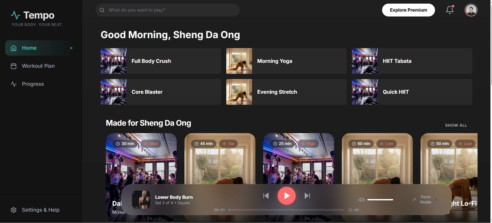

# Tempo - Fitness Web App



**Tempo** is a conceptual, high-end fitness application designed with a "Dark Mode Glassmorphism" aesthetic. It aims to motivate users through a visually immersed interface that combines the energy of music with the discipline of fitness. "Your Body. Your Beat."

## 🚀 Features

- **Immersive Interface**: A persistent, Spotify-inspired layout that maximizes content visibility.
- **Glassmorphism Design**: Extensive use of simple, elegant gradients and backdrop blurs to create depth and hierarchy.
- **Interactive "Active Coach"**: A floating bottom player bar that acts as a workout companion, featuring progress tracking, playback controls, and a dedicated "Form Guide".
- **Dynamic Content**: A grid of high-quality workout cards that respond to user interaction with subtle animations.
- **Responsive Layout**: Adapts gracefully from desktop to tablet views.

## 🛠️ Technology Stack

- **React**: Core UI library for component-based architecture.
- **Vite**: Next-generation frontend tooling for fast development and build.
- **Tailwind CSS**: Utility-first CSS framework for rapid, custom styling.
- **Framer Motion**: Production-ready animation library for React.
- **Lucide React**: Beautiful, consistent icon set.

## 📦 Getting Started

1. **Clone the repository**
   ```bash
   git clone https://github.com/shengda-ong/exercise_webapp.git
   ```

2. **Install dependencies**
   ```bash
   npm install
   ```

3. **Start the development server**
   ```bash
   npm run dev
   ```

4. **Build for production**
   ```bash
   npm run build
   ```

## 🎨 Design Philosophy

Tempo breaks away from sterile fitness apps by adopting a "night mode" first approach. The use of neon coral and electric teal against deep charcoal backgrounds evokes the feeling of a late-night gym session or a high-energy dance studio.

---
*Created for the Advanced Agentic Coding Project.*